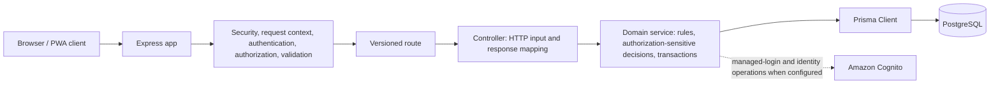

# Backend request architecture

The repository uses one Express application and one PostgreSQL database through Prisma. There is **no repository/data-access layer**.

`backend/app.js` mounts the versioned routes, parsers, CSRF protection, and error handler. Route middleware performs coarse authentication, role, permission, and event-duty checks. Controllers pass validated HTTP values and request metadata to services, then map service results to HTTP responses. Services own Prisma queries, transactions, audit writes, and authorization-sensitive resource checks.

Examples of the boundary:

- `registrationService` owns registration idempotency, duplicate handling, status history, audit logging, and its serializable transaction.
- `qrService` resolves the event before enforcing registration or QR-verification duty and owns QR data access.
- `signatureService` authorizes the signature target before writing its durable artifact record.
- `adminService` owns audit-log pagination and administrator maintenance orchestration.
- `accountService` records successful-login state after the Cognito callback has been verified.

Prisma is intentionally the data-access boundary. Adding a repository wrapper would only duplicate its queries and transactions without another persistence implementation to isolate.

## Transaction and provider boundaries

Services start transactions where one invariant spans multiple rows; controllers never select or mutate Prisma models. PostgreSQL is the durable transactional store represented by `DATABASE_URL` and the Prisma schema. The repository does not establish a deployed database or cloud topology.

Cognito is an optional configured identity-provider integration, not a replacement data layer. The managed login callback verifies Cognito tokens, synchronizes the local user, intersects Cognito group claims with locally assigned roles, and then writes the local login timestamp/audit record. Local authorization still uses the application database and event assignments.

## Request body limit

`REQUEST_BODY_LIMIT` is the single source of truth. `backend/config/env.js` validates it as a byte value and defaults it to `256kb`; `backend/app.js` passes `env.requestBodyLimit` to `express.json`. `backend/.env.example` documents the same setting. Provider webhooks are mounted before this JSON parser because their signature verification controls their body handling separately.
