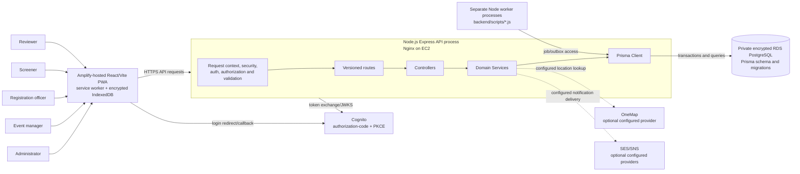

# VSMS context diagram

This source shows the implemented application boundary and the AWS topology
recorded on 11 August 2026. Current availability is verified separately.

## Evidence

- Client: `react-user-dashboard/src/` and `vite.config.ts`.
- API: `backend/app.js`, `backend/server.js`, `backend/routes/`.
- Database: `backend/prisma/schema.prisma` and `backend/prisma/migrations/`.
- Cognito: `backend/utils/cognitoClient.js` and `infrastructure/cognito.yaml`.
- Optional providers are shown as dotted edges because the final acceptance
  replay must prove delivery.
- Deployment evidence: `docs/2026-08-11_aws-cloud-deployment-runbook.md`.
