# Query-first NoSQL alternative (not implemented)

The common brief asks for a NoSQL design. VSMS selected PostgreSQL, so this
diagram records the evaluated query-first alternative without pretending that
it is part of the runtime. A single-table design would group event-scoped
records under one partition key and use sort-key prefixes for bounded access
patterns.

```mermaid
flowchart TB
    event[PK EVENT#eventId<br/>SK META]
    members[PK EVENT#eventId<br/>SK MEMBER#userId]
    registrations[PK EVENT#eventId<br/>SK REG#registrationId]
    queues[PK EVENT#eventId<br/>SK QUEUE#stationId#number]
    results[PK EVENT#eventId<br/>SK RESULT#registrationId#stationType]
    audits[PK EVENT#eventId<br/>SK AUDIT#timestamp#id]

    event --> members
    event --> registrations
    registrations --> queues
    registrations --> results
    event --> audits

    lookup[GSI1PK USER#userId<br/>GSI1SK EVENT#eventId]
    members -. assigned-event lookup .-> lookup
```

## Evaluated access patterns

- Load one event and its staffing plan.
- List a participant's registration, active queue entries and station results.
- Read a station queue in queue-number order.
- List events assigned to one staff user through a secondary index.
- Read immutable audit entries by event and time range.

The selected PostgreSQL model keeps referential integrity, multi-record
transactions and analytical joins in the database. No NoSQL table, handler or
deployment is claimed.
