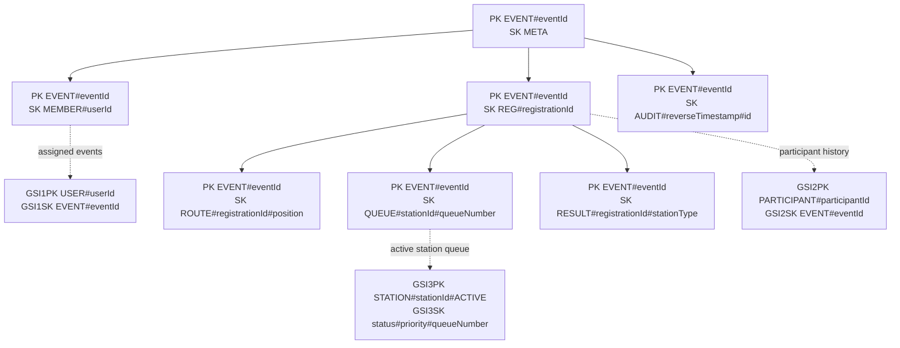

# Query-first NoSQL alternative and selection decision

VSMS deliberately uses PostgreSQL as its authoritative store. The rubric also
requires a NoSQL design, so this section evaluates a credible DynamoDB
single-table alternative without pretending that two production databases are
necessary. The selection favours PostgreSQL because the core workflow depends
on multi-record transactions, referential integrity and cross-event analytics.

## Access-pattern design

| Access pattern | Key condition | Consistency | Bound / protection |
| --- | --- | --- | --- |
| Load an event setup | `PK = EVENT#id`, bounded `SK` prefixes | Strong for management writes | One event partition; large audit history is paginated separately. |
| List events assigned to staff | `GSI1PK = USER#id` | Eventual is acceptable for navigation | Authorization is rechecked against the base membership item before mutation. |
| Load participant journey | Event partition plus `REG`, `ROUTE` and `RESULT` prefixes | Strong before queue/screening writes | A transaction conditions on registration and route versions. |
| Read a station queue | `GSI3PK = STATION#id#ACTIVE` ordered by status/priority/number | Eventual for display; strong base read before transition | Completed items leave the active index to prevent unbounded reads. |
| Read participant history | `GSI2PK = PARTICIPANT#id` | Eventual for history | Projection excludes NRIC and clinical bodies. |
| Read an audit range | Event partition plus reverse timestamp prefix | Eventual is acceptable | Monthly export/archival prevents a single hot, unbounded audit collection. |

## Integrity, scale and security decisions

- Registration, route creation and first queue entry use a DynamoDB transaction
  with version/absence conditions. Screening save and route advancement use a
  second idempotent transaction keyed by the client action ID.
- One event is a natural tenant boundary, but a very large event could create a
  hot partition. A production alternative would shard high-write queue/audit
  items by station or time bucket while keeping event metadata stable.
- Point-in-time recovery, KMS encryption, private endpoints, least-privilege IAM
  and CloudTrail are required. Sensitive attributes are excluded from GSIs.
- TTL is suitable only for ephemeral idempotency/offline-transfer receipts.
  Clinical, audit and referral retention follows policy-driven archival and
  deletion, never best-effort TTL alone.
- Conditional writes prevent lost updates. Eventual GSI reads are display hints;
  every protected mutation revalidates authoritative base items.

## Selection comparison

| Criterion | PostgreSQL selected runtime | DynamoDB alternative |
| --- | --- | --- |
| Transactional workflow | Natural relational transaction across registration, queue, result and audit rows | Possible, but each access pattern and transaction item set must be designed explicitly |
| Integrity | Foreign keys, unique constraints and migration-owned triggers | Conditional expressions and application-enforced relationships |
| Reporting | Direct joins, aggregates and percentile queries | Export/materialized projections or a separate analytics path |
| Offline/idempotent writes | Durable SQL ledger and unique constraints | Conditional put/update with idempotency item |
| Operations | Familiar PostgreSQL backup/restore with verified constraints/indexes | Managed scaling/PITR but more access-pattern and cost governance |

PostgreSQL therefore remains the smallest correct system for VSMS. IndexedDB
is used only as an encrypted client-side offline document/outbox store; it is
not a second server source of truth.
