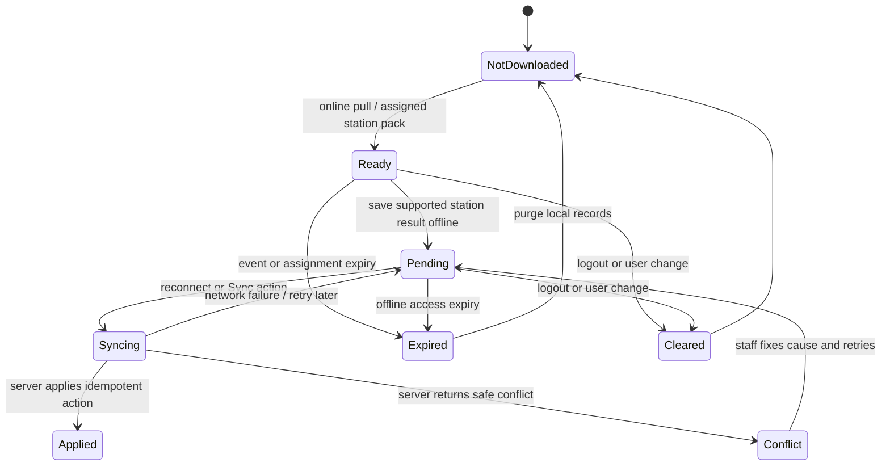

# VSMS offline synchronization

Current support covers assigned visual-acuity, refraction, colour-vision and
eye-health station flows. The service worker caches the app shell; clinical
packs and pending mutations remain separately encrypted in IndexedDB and are
bound to the signed-in owner and event.
