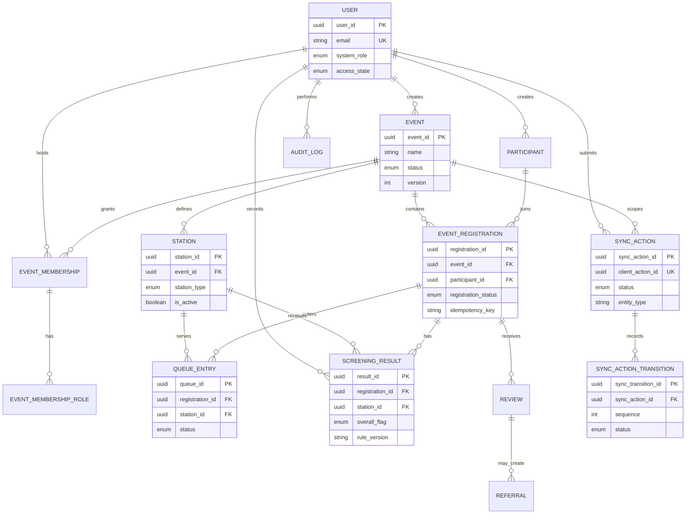

# PostgreSQL relational design

The Prisma schema and migrations are the canonical database design. This
focused ERD shows the records used by the event, screening and offline paths;
it is not a complete rendering of every supporting model.

The full model is in `backend/prisma/schema.prisma`. The standalone
`backend/stored_procedures.sql` file is documented separately because its
legacy table names do not establish that those procedures are installed in
the current Prisma schema.
