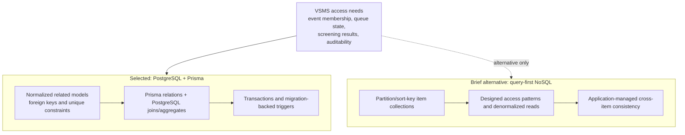

# Persistence access comparison

The project brief presents PostgreSQL and a query-first NoSQL model as
alternatives. The current repository selects PostgreSQL; the comparison below
records why the report uses relational access and does not imply a second
database implementation.

Repository evidence for the selected path is
`backend/prisma/schema.prisma`, `backend/prisma/migrations/` and the service
queries. No NoSQL table or handler is part of the current runtime contract.
