# VSMS secure API request path

```mermaid
flowchart LR
    client[React/Vite client]
    transport[HTTPS / configured API origin]
    context[Request context<br/>request ID + body limit]
    defenses[Security middleware<br/>CORS + Helmet + rate limit + CSRF]
    session[Session authentication]
    scope[Event membership / role / active duty]
    validate[Zod validation]
    idem[Idempotency key and fingerprint]
    controller[Controller]
    service[Domain service transaction]
    prisma[Prisma parameterized query]
    db[(PostgreSQL)]
    audit[Audit / sync ledger]

    client --> transport --> context --> defenses --> session --> scope --> validate --> idem --> controller --> service --> prisma --> db
    service --> audit
```

The canonical operation names and paths are in
[`api-requirement-map.md`](../api-requirement-map.md). This source deliberately
does not show an API gateway or serverless handler because those are not
verified components of the current application.
