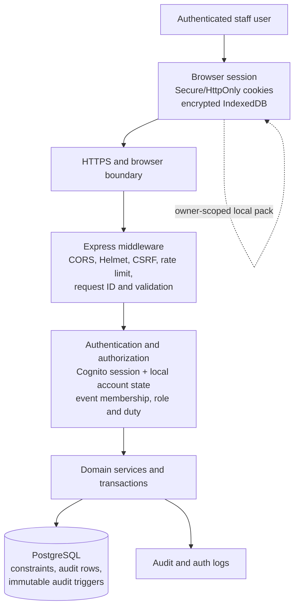

# VSMS security architecture

```mermaid
flowchart TB
    user[Authenticated staff user]
    browser[Browser session<br/>Secure/HttpOnly cookies<br/>encrypted IndexedDB]
    boundary[HTTPS and browser boundary]
    middleware[Express middleware<br/>CORS, Helmet, CSRF, rate limit,<br/>request ID and validation]
    auth[Authentication and authorization<br/>Cognito session + local account state<br/>event membership, role and duty]
    service[Domain services and transactions]
    data[(PostgreSQL<br/>constraints, audit rows,<br/>immutable audit triggers)]
    audit[Audit and auth logs]

    user --> browser --> boundary --> middleware --> auth --> service --> data
    service --> audit
    browser -.->|owner-scoped local pack| browser
```

The diagram represents repository controls. Network firewalls, host hardening,
backups, monitoring and live key rotation require deployment evidence.
