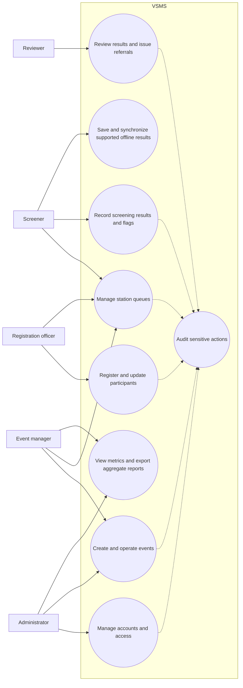

# VSMS use-case diagram

The use cases are limited to paths represented in the current OpenAPI contract
and frontend route structure.

The diagram does not imply that every role can access every event. Event
membership, role and active duty checks are enforced by the backend.
