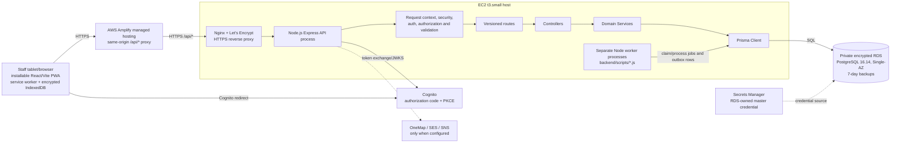

# VSMS deployment diagram

This is the topology recorded in the 11 August 2026 deployment runbook. It is
historical deployment evidence; current availability is verified separately.

## Deployment limits

- The EC2 API and separate workers are supervised by systemd; RDS accepts port
  5432 only from the EC2 security group.
- Amplify serves the PWA and proxies `/api/*` so secure OAuth cookies remain
  same-origin.
- An encrypted RDS snapshot and automated backups existed at deployment; the
  repeatable recovery workflow separately proves logical restore integrity.
- `backend/docker-compose.yml` provides local Redis support for rate limiting;
  it is not proof of a deployed shared Redis service.
- Single-AZ RDS and one EC2 host are documented availability limits.
