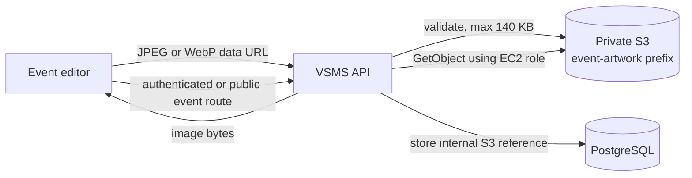

# Event artwork S3 setup report

Date: 13 August 2026  
Environment: AWS Academy account `912904791907`, `us-east-1`  
Bucket: `vsms-user-uploads-912904791907-us-east-1-an`

> [!WARNING]
> Temporary AWS session credentials were pasted into chat during this work. They are not included in this repository or report. End the current lab session after deployment so those credentials expire; start a new session before doing more AWS work.

## Outcome

VSMS event artwork is being moved from inline database data URLs to the existing private S3 bucket. The application stores only an internal `s3://event-artwork/...` reference in PostgreSQL and streams the image through an authorized VSMS endpoint. The browser never receives the bucket name, AWS credentials, or a public S3 URL.

This is deliberately limited to custom event artwork. Participant documents, clinical attachments, and other uploads are outside this change.

## Evidence, finding, and path

| Evidence | Finding | Path taken |
|---|---|---|
| The bucket exists in `us-east-1`; versioning is enabled; all four public-access-block controls are enabled; default encryption is AES-256; no bucket policy or CORS rules are present. | The existing bucket is suitable for private server-side event artwork. | Reuse the bucket and the EC2 instance role; do not make the bucket public or add browser CORS access. |
| A temporary sentinel object could be written, read, and deleted through the EC2 `LabRole`; S3 reported server-side encryption. | EC2 already has working access without static AWS keys. | Use the instance role. Do not copy AWS access keys into `/etc/vsms.env`. |
| Production contained one custom event image stored as an inline data URL and no S3 artwork references. | Existing artwork needs a one-time migration after the new code is live. | Run the idempotent migration script and verify the database no longer contains inline event artwork. |
| Production logs recorded `POST /api/v1/events` responses with `422 VALIDATION_ERROR` when Create draft was tried. In the browser, required event fields were blank after the page state had reset. | Create draft reached the API; it was rejected by normal request validation, not by S3. | Re-enter the required event name, venue, postal code, dates, and expected attendance. S3 work is separate from this validation failure. |

## Storage design



Controls added:

- JPEG and WebP only, with a 140 KB decoded size limit.
- Content-addressed object names under `event-artwork/`; original filenames are not stored.
- Private objects with AES-256 server-side encryption.
- Authenticated artwork reads follow the existing event-role authorization.
- Public artwork reads are limited to published, in-progress, completed, or cancelled events.
- The CloudFormation task role is limited to `GetObject`, `PutObject`, and `DeleteObject` under this bucket prefix.
- Development remains backward-compatible: when `EVENT_ARTWORK_BUCKET` is absent, inline artwork continues to work.

## Application configuration

The production environment needs only the bucket name:

```text
EVENT_ARTWORK_BUCKET=vsms-user-uploads-912904791907-us-east-1-an
```

No AWS access key, secret key, or session token should be added. On EC2, the AWS SDK obtains short-lived credentials from the attached instance role.

For the ECS CloudFormation stack, pass the existing bucket through `EventArtworkBucketName`. The API task role receives prefix-scoped object permissions only when that parameter is set.

## Migration and verification

Run from the deployed backend with the production environment loaded:

```bash
pnpm artwork:migrate-s3 -- --dry-run
pnpm artwork:migrate-s3
```

The script selects only `data:image/...` event artwork, uploads it, and changes the row only if its old value is unchanged. It is safe to rerun.

Verify the service and migration without printing secrets:

```bash
systemctl is-active vsms-backend.service
curl --fail --silent https://vsms-52-4-124-186.nip.io/health
```

Then confirm:

- no event artwork row begins with `data:image/`;
- migrated rows begin with `s3://event-artwork/`;
- the matching S3 objects are encrypted and remain private;
- an authorized event response contains a VSMS `/api/v1/events/.../artwork` URL, not an S3 URL;
- a draft event artwork URL is unavailable through the public route.

## Local validation completed

- Docker CI image built successfully.
- Event artwork storage and security checks: 37 passed.
- Availability infrastructure checks: 5 passed.
- OpenAPI document valid and generated frontend contract exact.
- Frontend TypeScript and production build passed.
- S3 sentinel write/read/delete check passed through the EC2 instance role.

## Rollback

Before deployment, retain the existing `/opt/vsms` release and a database backup. If the new API fails before the data migration, move the previous release back and restart the services. If rollback is required after artwork rows have been migrated, restore the pre-migration database backup before running the old application because the old release does not understand internal S3 references.

Do not delete the S3 objects during an emergency rollback. They contain no participant data and keeping the versioned objects preserves recovery options.

## Create draft troubleshooting

The observed failure was a request validation error. It can be reproduced when required fields are blank. The minimum draft requires:

- event name;
- venue/address and postal code;
- valid start and end dates;
- expected attendance within the accepted range.

If a fully completed form still returns 422, capture the response body and request ID from the browser network panel; the server log alone intentionally omits submitted field values.

---

Prepared by OpenAI Codex in the T3 Code harness (GPT-5.6).
