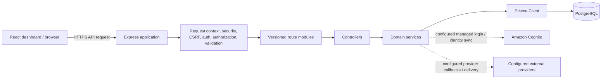

# VSMS component diagram

This diagram reflects the repository implementation, not a proposed cloud deployment. The API has no repository layer: Prisma is the data-access client used by domain services.

Controllers handle HTTP input and response mapping. Services own business rules, authorization-sensitive resource decisions, audit writes, and transactions. `backend/docs/request-architecture.md` records the concrete boundary and examples.
