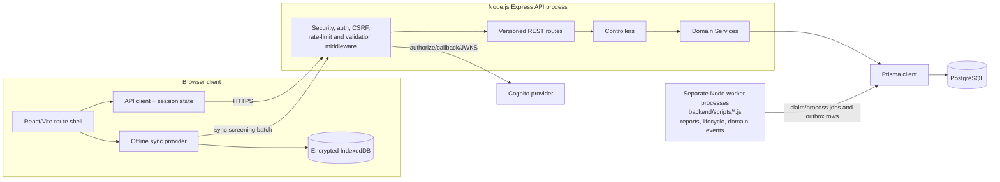

# VSMS component diagram

The component boundaries retain the browser/offline, Express, provider and
worker detail from this report while following the #105 request boundary:
versioned route and middleware → Controller → Service → Prisma. There is no
repository layer. Worker scripts are separate Node processes over the same
PostgreSQL state, not in-process Express workers or serverless services.

## Evidence

- Browser feature modules: `react-user-dashboard/src/features/`.
- API composition: `backend/app.js`, `backend/routes/`,
  `backend/controllers/`, `backend/services/`.
- Worker entry points: `backend/scripts/`.
- Persistence: `backend/prisma/prismaClient.js` and the Prisma schema.
