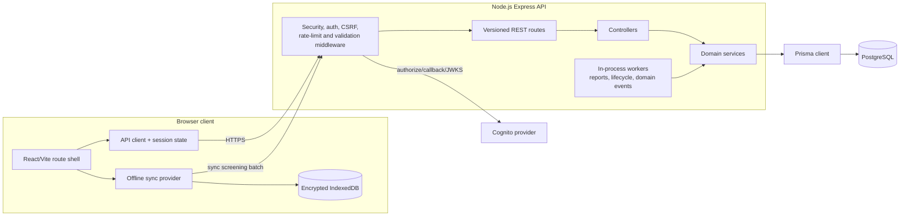

# VSMS component diagram

The component boundaries follow the current folder structure and request
path. Workers are backend processes over the same PostgreSQL state, not
separate serverless services.

## Evidence

- Browser feature modules: `react-user-dashboard/src/features/`.
- API composition: `backend/app.js`, `backend/routes/`,
  `backend/controllers/`, `backend/services/`.
- Worker entry points: `backend/scripts/`.
- Persistence: `backend/prisma/prismaClient.js` and the Prisma schema.
