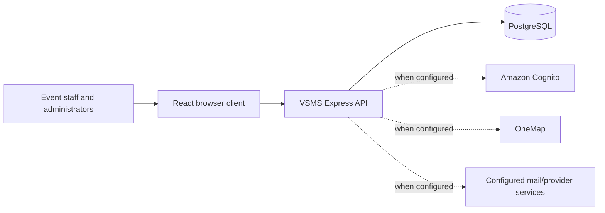

# VSMS system context

The repository proves the application integrations and configuration seams above. It does not prove a deployed AWS account, API Gateway, ECS/Lambda, WAF, S3/CloudFront, DynamoDB, Secrets Manager, or CloudWatch deployment; those are not presented as current infrastructure.
