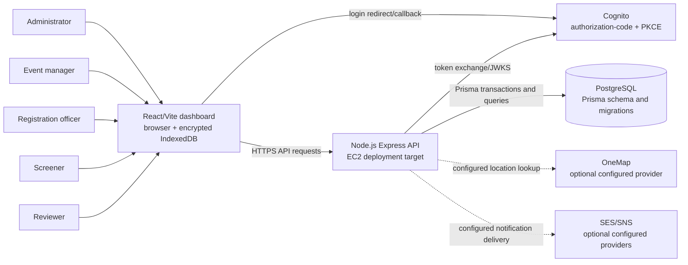

# VSMS context diagram

This source shows the current repository boundary: browser client, Express
API, PostgreSQL and Cognito. It does not show proposed alternatives or a live
deployment.

## Evidence

- Client: `react-user-dashboard/src/` and `vite.config.ts`.
- API: `backend/app.js`, `backend/server.js`, `backend/routes/`.
- Database: `backend/prisma/schema.prisma` and `backend/prisma/migrations/`.
- Cognito: `backend/utils/cognitoClient.js` and `infrastructure/cognito.yaml`.
- Optional providers are shown as dotted edges because repository source does
  not prove external availability or delivery.
