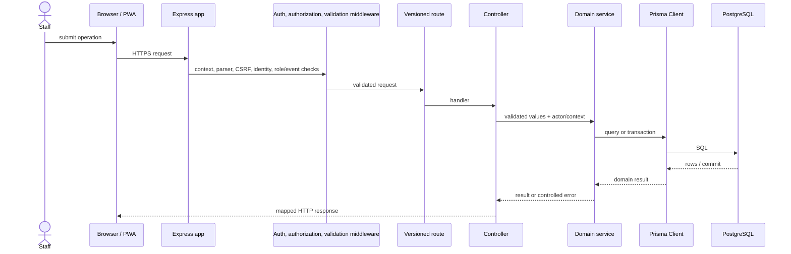

# VSMS request sequence

The normal online request path is implemented as follows. Offline browser storage and retry UI are client concerns; the server-side sync endpoint is an event-scoped service request in the same flow.

For managed login, the authentication controller additionally exchanges the authorization code and verifies Cognito tokens before calling the account service to persist local session state. Cognito is not in ordinary event-data requests. No repository component exists between services and Prisma.
