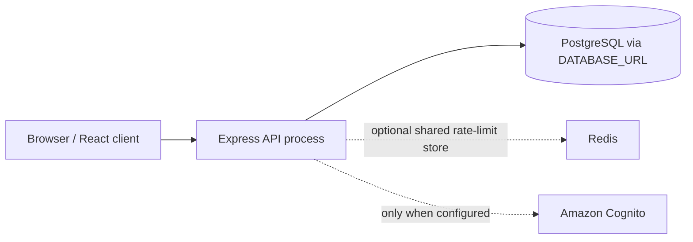

# Repository-evidenced runtime and deployment boundary

The repository contains an Express API, Prisma schema/migrations for PostgreSQL, a React client, and local Redis compose support for rate limiting. It does not contain an infrastructure definition or deployment record proving a cloud topology.

`backend/docker-compose.yml` defines only local Redis support. PostgreSQL, Cognito, and any mail/provider services are configured externally; their deployed instances, regions, availability characteristics, and secrets management are outside the local evidence. Production TLS enforcement and CORS restrictions are application configuration, not proof of a deployed gateway or WAF.
