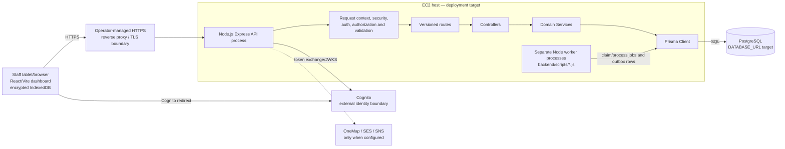

# VSMS deployment diagram

This is the repository-supported target topology. The EC2 node and reverse
proxy are deployment targets/prerequisites; this repository contains no live
instance, security-group or certificate evidence. The Express request path
follows the #105 route → Controller → Service → Prisma boundary.

## Deployment limits

- `backend/server.js` can start the API; `README.md` documents production
  environment and reverse-proxy prerequisites.
- PostgreSQL provisioning, network policy, backups, monitoring, process
  supervision and recovery are operational work outside the repository.
- The browser offline pack is an application feature, not a service-worker
  cache. A hard refresh while offline is not claimed to work.
- No serverless, static object-storage, or managed secret-store node is shown
  because none is verified as the current deployment architecture.
