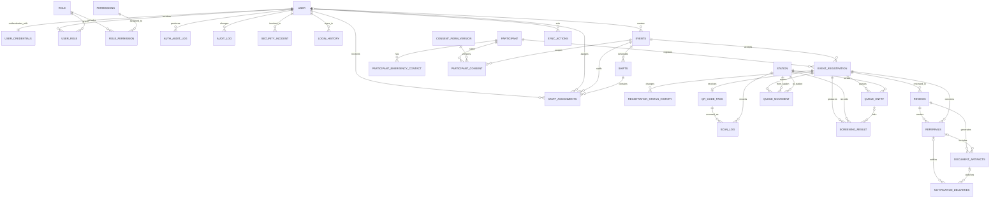
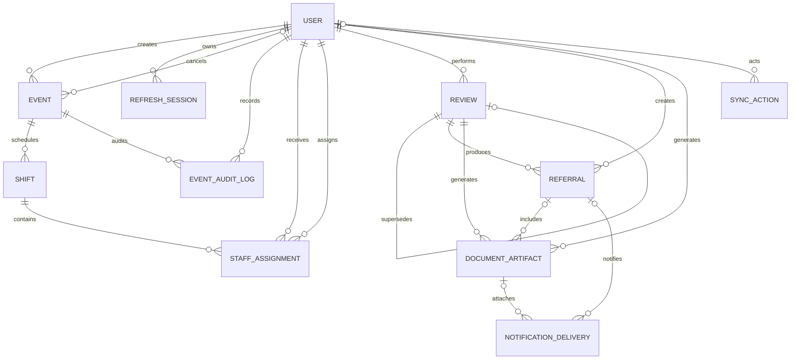

# VSMS Database ERD

This document has two deliberately separate views:

1. **Platform reference ERD** — the 30-table model supplied by the project owner
   on 22 July 2026. This is the intended VSMS domain map.
2. **Issue #7 Prisma implementation** — the smaller schema currently present in
   `backend/prisma/schema.prisma` on `nachikethreddyy/event-details`.

They are not yet identical. Issue #7 does not silently create the missing
participant, registration, queue, station, or screening domains. The identity
differences are called out below so a later migration can reconcile them safely.

## Platform reference ERD — all tables

### Reference table inventory

| # | Reference table | Primary key | Main foreign keys / purpose |
|---:|---|---|---|
| 1 | `User` | `user_id` | Staff profile; parent of credentials, roles, audit, login, and operational actor records |
| 2 | `User_Credentials` | `credential_id` | Unique `user_id`; username, password hash/change time, failed attempts, lock and MFA state |
| 3 | `Role` | `role_id` | Unique role name, description, precedence |
| 4 | `Permissions` | `permission_id` | Unique permission name and description |
| 5 | `Role_Permission` | (`role_id`, `permission_id`) | Role-to-permission bridge |
| 6 | `UserRole` | (`user_id`, `role_id`) | User-to-role bridge with assigner and timestamp |
| 7 | `AuthAuditLog` | `auth_log_id` | Nullable user/device, event type, outcome, failure category, identifier hash, IP, user agent, request ID |
| 8 | `AuditLog` | `audit_id` | User, action, entity name/ID, old/new JSON, IP, device name, timestamp |
| 9 | `SecurityIncident` | `incident_id` | User, incident type/severity, description, resolution state and resolver |
| 10 | `LoginHistory` | `login_id` | User login/logout time, status, IP, and device |
| 11 | `Events` | `event_id` | Name, description, venue, schedule, capacity, status, creator, cancellation, timestamps |
| 12 | `Shifts` | `shift_id` | Event, name, schedule, required staff, status, timestamps |
| 13 | `Staff_Assignments` | `assignment_id` | Event, shift, user, optional station, role/status, assigner, notes |
| 14 | `Participant` | `participant_id` | Identity/contact, demographics, consent state, timestamps |
| 15 | `ParticipantEmergencyContact` | `emergency_contact_id` | Participant contact details, status, creator/updater |
| 16 | `ConsentFormVersion` | `consent_form_version_id` | Form code/version/title/content hash/object key and effective dates |
| 17 | `ParticipantConsent` | `consent_id` | Participant, event, optional registration, form version, signature evidence and withdrawal state |
| 18 | `EventRegistration` | `registration_id` | Participant/event, queue number, registration status, registrar, check-in/out |
| 19 | `RegistrationStatusHistory` | `history_id` | Registration status transition, actor, reason, timestamp |
| 20 | `QRCodePass` | `qr_id` | Unique registration/token hashes, issue/expiry/use/revocation data |
| 21 | `ScanLog` | `scan_id` | QR, user, station, result, device, IP, scan time |
| 22 | `STATION` | `station_id` | Event station name/type/order, active flag, creation time |
| 23 | `QueueEntry` | `queue_entry_id` | Registration/station, queue number, state and timing |
| 24 | `QueueMovement` | `movement_id` | Registration, from/to station, actor, movement reason/time |
| 25 | `ScreeningResult` | `result_id` | Registration/station/queue, recorder, screening type, JSON result, flags and idempotency key |
| 26 | `Reviews` | `review_id` | Registration/reviewer, outcome, urgency, clinical summary, recommendation, version chain |
| 27 | `Referrals` | `referral_id` | Review/registration/creator, destination, reason, instructions, urgency/status |
| 28 | `Document_Artifacts` | `document_id` | Review/referral, type/version, storage/hash/MIME/size, generator, expiry |
| 29 | `Notification_Deliveries` | `notification_id` | Referral/document, channel, encrypted recipient, provider status and idempotency |
| 30 | `Sync_Actions` | `sync_action_id` | Device/user/registration, entity operation, version, payload, attempts and resolution |

## Issue #7 Prisma implementation

The branch currently implements eleven physical tables. Names below match
`schema.prisma`; mapped PostgreSQL names appear in parentheses.

| Prisma model | PostgreSQL table | Key implementation constraints |
|---|---|---|
| `User` | `users` | UUID; normalized unique temporary username and email; bcrypt hash; flat system role/status and lock counters |
| `RefreshSession` | `refresh_sessions` | Hashed one-time token; indexed family; rotation/reuse/revocation evidence; secure cookie transport |
| `Event` | `events` | UUID; persisted banner choice; timezone; version; positive capacity; end after start; consistent cancellation fields |
| `EventAuditLog` | `event_audit_logs` | UUID; event/actor relations; redacted snapshots; append-only database trigger |
| `Shift` | `shifts` | UUID; event relation; unique event/name/start; valid range and staff count |
| `StaffAssignment` | `staff_assignments` | UUID; shift/user/assigner relations and role/status |
| `Review` | `reviews` | UUID; reviewer relation, version uniqueness, optional supersession |
| `Referral` | `referrals` | UUID; review, registration placeholder, creator relation |
| `DocumentArtifact` | `document_artifacts` | UUID; review/referral/generator relations and version uniqueness |
| `NotificationDelivery` | `notification_deliveries` | UUID; referral/document relations and unique idempotency key |
| `SyncAction` | `sync_actions` | UUID; optional actor and unresolved registration UUID; device/action uniqueness |

### Issue #7 Prisma changes

- `Event.bannerKey` stores the selected first-party event artwork; `Event.timezone` and optimistic-concurrency `Event.version` are added.
- `EventAuditLog` is added as an event-specific immutable history. The platform
  reference instead shows a generic `AuditLog`; consolidation is a later schema
  decision and must happen before both are deployed together.
- Actor UUID fields are connected to the branch `User` model.
- A minimal bcrypt/JWT login temporarily keeps username, credential, and role
  fields on `User`. The platform reference correctly separates them into
  `User_Credentials`, `Role`, `UserRole`, and `Permissions`.
- A `RefreshSession` table supports the retained secure HttpOnly cookie flow.
  The access token itself stays only in browser memory.

### Required reconciliation before a populated deployment

The migration intentionally stops if any actor-bearing domain table already
contains rows. Before production deployment, a reviewed migration must:

1. adopt the supplied reference `User` / `User_Credentials` / role model;
2. map every actor UUID without fabricating identities;
3. decide whether `EventAuditLog` remains event-specific or becomes part of the
   reference `AuditLog` design;
4. restore the reference participant, registration, station, queue, screening,
   consent, QR, login-history, security-incident, and permission models from
   their canonical migrations; and
5. back up, rehearse, and verify foreign-key and row-count invariants before cutover.

## Prisma enumerations used by issue #7

- `SystemRole`: `ADMIN`, `EVENT_MANAGER`, `STAFF`
- `UserStatus`: `ACTIVE`, `DISABLED`
- `EventStatus`: `DRAFT`, `PUBLISHED`, `IN_PROGRESS`, `COMPLETED`, `CANCELLED`
- `EventAuditAction`: `CREATED`, `UPDATED`, `PUBLISHED`, `STARTED`, `COMPLETED`, `CANCELLED`
- `ShiftStatus`: `PLANNED`, `ACTIVE`, `COMPLETED`, `CANCELLED`
- `StaffAssignmentRole`: `EVENT_MANAGER`, `REGISTRATION`, `SCREENER`, `REVIEWER`, `SUPPORT`
`StaffAssignmentStatus`: `ASSIGNED`, `CONFIRMED`, `COMPLETED`, `CANCELLED`

Other clinical, referral, notification, and sync enums are defined in
`backend/prisma/schema.prisma` and remain unchanged by the event lifecycle work.
